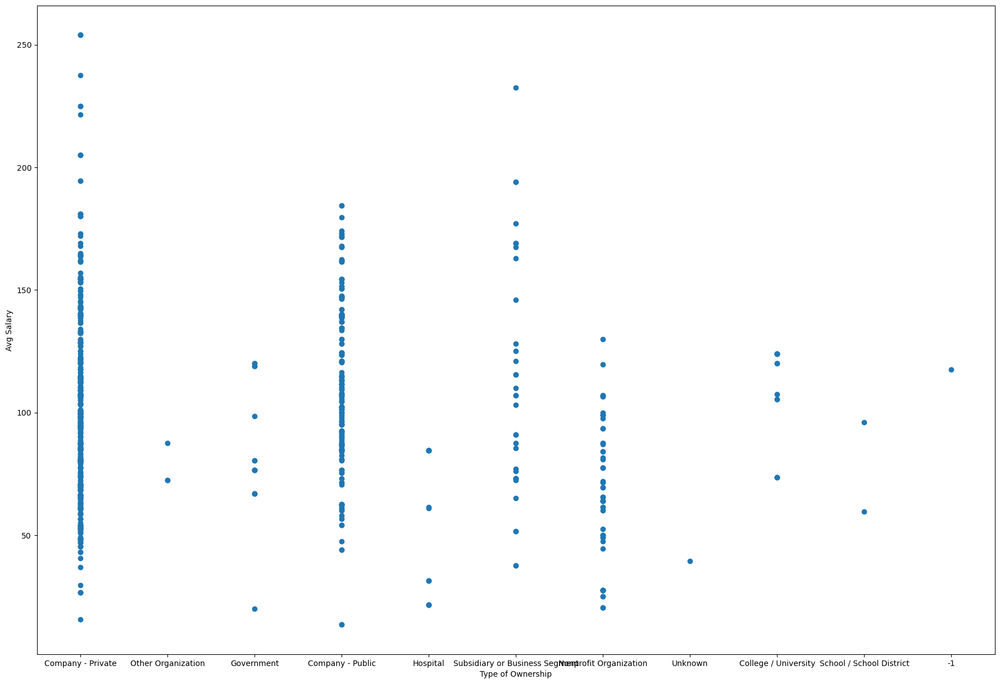
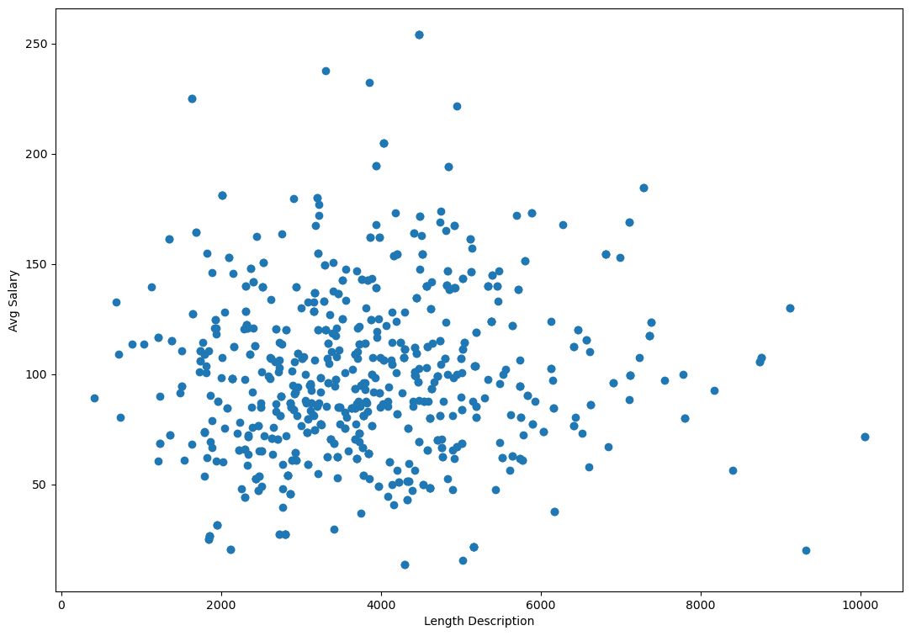
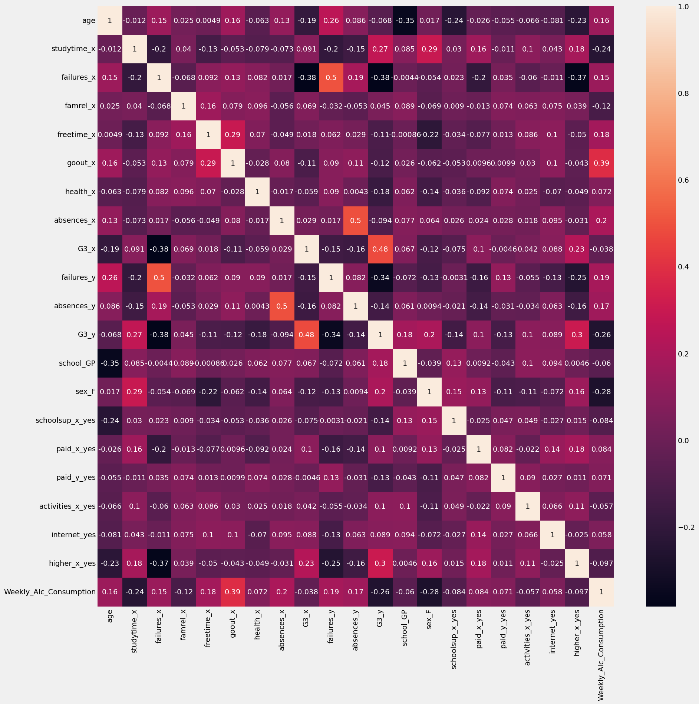
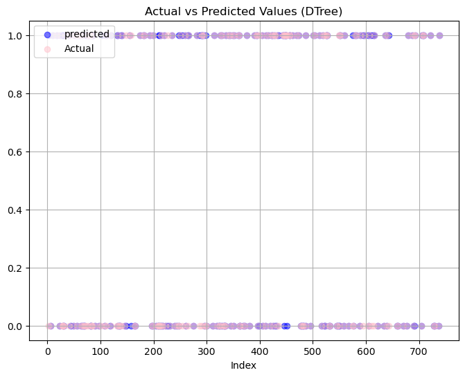
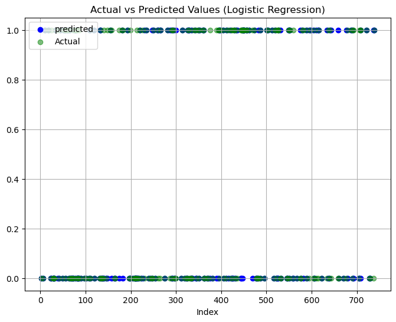
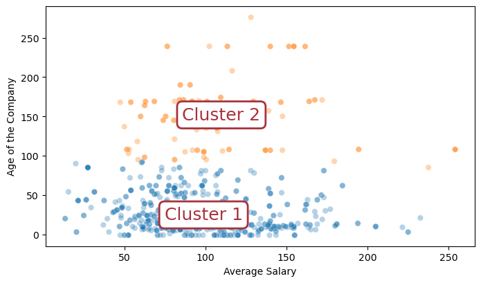
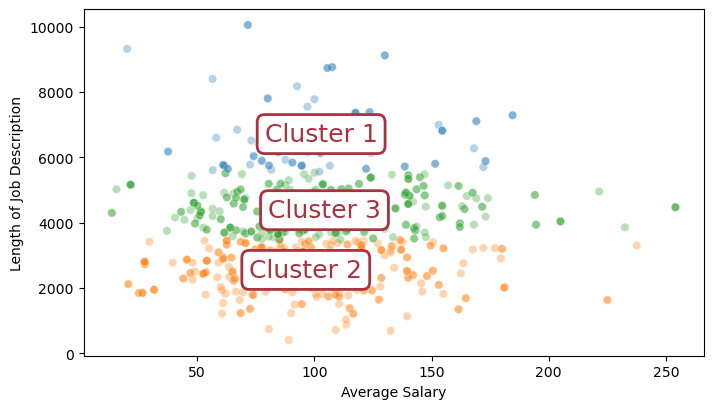
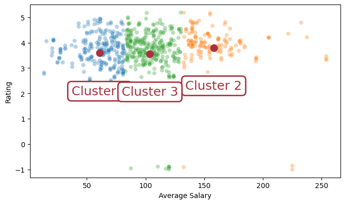

```python
import pandas as pd
import numpy as np
from sklearn.model_selection import train_test_split
from sklearn.model_selection import cross_val_score, LeaveOneOut, RepeatedKFold
from sklearn.metrics import mean_squared_error, roc_curve, auc, f1_score, accuracy_score
import matplotlib.pyplot as plt
from sklearn import tree
from sklearn.naive_bayes import CategoricalNB
from sklearn.linear_model import LogisticRegression
from sklearn.impute import SimpleImputer

import warnings
import seaborn as sns

warnings.filterwarnings('ignore')
```


```python
salary = pd.read_csv('eda_data.csv.zip')
salary.head()
```


<div>
<style scoped>
    .dataframe tbody tr th:only-of-type {
        vertical-align: middle;
    }

    .dataframe tbody tr th {
        vertical-align: top;
    }

    .dataframe thead th {
        text-align: right;
    }
</style>
<table border="1" class="dataframe">
  <thead>
    <tr style="text-align: right;">
      <th></th>
      <th>Unnamed: 0</th>
      <th>Job Title</th>
      <th>Salary Estimate</th>
      <th>Job Description</th>
      <th>Rating</th>
      <th>Company Name</th>
      <th>Location</th>
      <th>Headquarters</th>
      <th>Size</th>
      <th>Founded</th>
      <th>...</th>
      <th>age</th>
      <th>python_yn</th>
      <th>R_yn</th>
      <th>spark</th>
      <th>aws</th>
      <th>excel</th>
      <th>job_simp</th>
      <th>seniority</th>
      <th>desc_len</th>
      <th>num_comp</th>
    </tr>
  </thead>
  <tbody>
    <tr>
      <th>0</th>
      <td>0</td>
      <td>Data Scientist</td>
      <td>$53K-$91K (Glassdoor est.)</td>
      <td>Data Scientist\nLocation: Albuquerque, NM\nEdu...</td>
      <td>3.8</td>
      <td>Tecolote Research\n3.8</td>
      <td>Albuquerque, NM</td>
      <td>Goleta, CA</td>
      <td>501 to 1000 employees</td>
      <td>1973</td>
      <td>...</td>
      <td>47</td>
      <td>1</td>
      <td>0</td>
      <td>0</td>
      <td>0</td>
      <td>1</td>
      <td>data scientist</td>
      <td>na</td>
      <td>2536</td>
      <td>0</td>
    </tr>
    <tr>
      <th>1</th>
      <td>1</td>
      <td>Healthcare Data Scientist</td>
      <td>$63K-$112K (Glassdoor est.)</td>
      <td>What You Will Do:\n\nI. General Summary\n\nThe...</td>
      <td>3.4</td>
      <td>University of Maryland Medical System\n3.4</td>
      <td>Linthicum, MD</td>
      <td>Baltimore, MD</td>
      <td>10000+ employees</td>
      <td>1984</td>
      <td>...</td>
      <td>36</td>
      <td>1</td>
      <td>0</td>
      <td>0</td>
      <td>0</td>
      <td>0</td>
      <td>data scientist</td>
      <td>na</td>
      <td>4783</td>
      <td>0</td>
    </tr>
    <tr>
      <th>2</th>
      <td>2</td>
      <td>Data Scientist</td>
      <td>$80K-$90K (Glassdoor est.)</td>
      <td>KnowBe4, Inc. is a high growth information sec...</td>
      <td>4.8</td>
      <td>KnowBe4\n4.8</td>
      <td>Clearwater, FL</td>
      <td>Clearwater, FL</td>
      <td>501 to 1000 employees</td>
      <td>2010</td>
      <td>...</td>
      <td>10</td>
      <td>1</td>
      <td>0</td>
      <td>1</td>
      <td>0</td>
      <td>1</td>
      <td>data scientist</td>
      <td>na</td>
      <td>3461</td>
      <td>0</td>
    </tr>
    <tr>
      <th>3</th>
      <td>3</td>
      <td>Data Scientist</td>
      <td>$56K-$97K (Glassdoor est.)</td>
      <td>*Organization and Job ID**\nJob ID: 310709\n\n...</td>
      <td>3.8</td>
      <td>PNNL\n3.8</td>
      <td>Richland, WA</td>
      <td>Richland, WA</td>
      <td>1001 to 5000 employees</td>
      <td>1965</td>
      <td>...</td>
      <td>55</td>
      <td>1</td>
      <td>0</td>
      <td>0</td>
      <td>0</td>
      <td>0</td>
      <td>data scientist</td>
      <td>na</td>
      <td>3883</td>
      <td>3</td>
    </tr>
    <tr>
      <th>4</th>
      <td>4</td>
      <td>Data Scientist</td>
      <td>$86K-$143K (Glassdoor est.)</td>
      <td>Data Scientist\nAffinity Solutions / Marketing...</td>
      <td>2.9</td>
      <td>Affinity Solutions\n2.9</td>
      <td>New York, NY</td>
      <td>New York, NY</td>
      <td>51 to 200 employees</td>
      <td>1998</td>
      <td>...</td>
      <td>22</td>
      <td>1</td>
      <td>0</td>
      <td>0</td>
      <td>0</td>
      <td>1</td>
      <td>data scientist</td>
      <td>na</td>
      <td>2728</td>
      <td>3</td>
    </tr>
  </tbody>
</table>
<p>5 rows × 33 columns</p>
</div>


# Cleaning


```python
salary_df = salary.drop(columns = ['Unnamed: 0' , 'seniority', 'Job Description', 'Headquarters', 'job_simp', 'Industry', 'Sector', 'Revenue',
                               'Competitors', 'company_txt', 'hourly', 'employer_provided', 'Salary Estimate', 'Founded', 'min_salary', 'max_salary', 'Company Name', 'Size',
                                  'Location'])
salary_df
```


<div>
<style scoped>
    .dataframe tbody tr th:only-of-type {
        vertical-align: middle;
    }

    .dataframe tbody tr th {
        vertical-align: top;
    }

    .dataframe thead th {
        text-align: right;
    }
</style>
<table border="1" class="dataframe">
  <thead>
    <tr style="text-align: right;">
      <th></th>
      <th>Job Title</th>
      <th>Rating</th>
      <th>Type of ownership</th>
      <th>avg_salary</th>
      <th>job_state</th>
      <th>same_state</th>
      <th>age</th>
      <th>python_yn</th>
      <th>R_yn</th>
      <th>spark</th>
      <th>aws</th>
      <th>excel</th>
      <th>desc_len</th>
      <th>num_comp</th>
    </tr>
  </thead>
  <tbody>
    <tr>
      <th>0</th>
      <td>Data Scientist</td>
      <td>3.8</td>
      <td>Company - Private</td>
      <td>72.0</td>
      <td>NM</td>
      <td>0</td>
      <td>47</td>
      <td>1</td>
      <td>0</td>
      <td>0</td>
      <td>0</td>
      <td>1</td>
      <td>2536</td>
      <td>0</td>
    </tr>
    <tr>
      <th>1</th>
      <td>Healthcare Data Scientist</td>
      <td>3.4</td>
      <td>Other Organization</td>
      <td>87.5</td>
      <td>MD</td>
      <td>0</td>
      <td>36</td>
      <td>1</td>
      <td>0</td>
      <td>0</td>
      <td>0</td>
      <td>0</td>
      <td>4783</td>
      <td>0</td>
    </tr>
    <tr>
      <th>2</th>
      <td>Data Scientist</td>
      <td>4.8</td>
      <td>Company - Private</td>
      <td>85.0</td>
      <td>FL</td>
      <td>1</td>
      <td>10</td>
      <td>1</td>
      <td>0</td>
      <td>1</td>
      <td>0</td>
      <td>1</td>
      <td>3461</td>
      <td>0</td>
    </tr>
    <tr>
      <th>3</th>
      <td>Data Scientist</td>
      <td>3.8</td>
      <td>Government</td>
      <td>76.5</td>
      <td>WA</td>
      <td>1</td>
      <td>55</td>
      <td>1</td>
      <td>0</td>
      <td>0</td>
      <td>0</td>
      <td>0</td>
      <td>3883</td>
      <td>3</td>
    </tr>
    <tr>
      <th>4</th>
      <td>Data Scientist</td>
      <td>2.9</td>
      <td>Company - Private</td>
      <td>114.5</td>
      <td>NY</td>
      <td>1</td>
      <td>22</td>
      <td>1</td>
      <td>0</td>
      <td>0</td>
      <td>0</td>
      <td>1</td>
      <td>2728</td>
      <td>3</td>
    </tr>
    <tr>
      <th>...</th>
      <td>...</td>
      <td>...</td>
      <td>...</td>
      <td>...</td>
      <td>...</td>
      <td>...</td>
      <td>...</td>
      <td>...</td>
      <td>...</td>
      <td>...</td>
      <td>...</td>
      <td>...</td>
      <td>...</td>
      <td>...</td>
    </tr>
    <tr>
      <th>737</th>
      <td>Sr Scientist, Immuno-Oncology - Oncology</td>
      <td>3.9</td>
      <td>Company - Public</td>
      <td>84.5</td>
      <td>MA</td>
      <td>0</td>
      <td>190</td>
      <td>0</td>
      <td>0</td>
      <td>0</td>
      <td>1</td>
      <td>0</td>
      <td>6162</td>
      <td>3</td>
    </tr>
    <tr>
      <th>738</th>
      <td>Senior Data Engineer</td>
      <td>4.4</td>
      <td>Company - Public</td>
      <td>102.5</td>
      <td>TN</td>
      <td>0</td>
      <td>14</td>
      <td>1</td>
      <td>0</td>
      <td>1</td>
      <td>1</td>
      <td>0</td>
      <td>6130</td>
      <td>3</td>
    </tr>
    <tr>
      <th>739</th>
      <td>Project Scientist - Auton Lab, Robotics Institute</td>
      <td>2.6</td>
      <td>College / University</td>
      <td>73.5</td>
      <td>PA</td>
      <td>1</td>
      <td>36</td>
      <td>0</td>
      <td>0</td>
      <td>0</td>
      <td>0</td>
      <td>1</td>
      <td>3078</td>
      <td>0</td>
    </tr>
    <tr>
      <th>740</th>
      <td>Data Science Manager</td>
      <td>3.2</td>
      <td>Company - Private</td>
      <td>127.5</td>
      <td>PA</td>
      <td>0</td>
      <td>-1</td>
      <td>0</td>
      <td>0</td>
      <td>0</td>
      <td>0</td>
      <td>1</td>
      <td>1642</td>
      <td>0</td>
    </tr>
    <tr>
      <th>741</th>
      <td>Research Scientist – Security and Privacy</td>
      <td>3.6</td>
      <td>Nonprofit Organization</td>
      <td>93.5</td>
      <td>OH</td>
      <td>0</td>
      <td>53</td>
      <td>1</td>
      <td>0</td>
      <td>0</td>
      <td>0</td>
      <td>0</td>
      <td>3673</td>
      <td>0</td>
    </tr>
  </tbody>
</table>
<p>742 rows × 14 columns</p>
</div>


```python
plt.figure(figsize= (22,15))
plt.scatter(salary_df['Type of ownership'], salary_df['avg_salary'])
plt.xlabel('Type of Ownership')
plt.ylabel('Avg Salary')
```


    Text(0, 0.5, 'Avg Salary')


    

    


```python
plt.figure(figsize= (13,9))
plt.scatter(salary_df['desc_len'], salary_df['avg_salary'])
plt.xlabel('Length Description')
plt.ylabel('Avg Salary')
```


    Text(0, 0.5, 'Avg Salary')


    

    


```python

```


```python
salary_df.hist(figsize = (11,10))
plt.tight_layout()

```


    

    


```python

```


```python
salary_df.describe()
```


<div>
<style scoped>
    .dataframe tbody tr th:only-of-type {
        vertical-align: middle;
    }

    .dataframe tbody tr th {
        vertical-align: top;
    }

    .dataframe thead th {
        text-align: right;
    }
</style>
<table border="1" class="dataframe">
  <thead>
    <tr style="text-align: right;">
      <th></th>
      <th>Rating</th>
      <th>avg_salary</th>
      <th>same_state</th>
      <th>age</th>
      <th>python_yn</th>
      <th>R_yn</th>
      <th>spark</th>
      <th>aws</th>
      <th>excel</th>
      <th>desc_len</th>
      <th>num_comp</th>
    </tr>
  </thead>
  <tbody>
    <tr>
      <th>count</th>
      <td>742.000000</td>
      <td>742.000000</td>
      <td>742.000000</td>
      <td>742.000000</td>
      <td>742.000000</td>
      <td>742.000000</td>
      <td>742.000000</td>
      <td>742.000000</td>
      <td>742.000000</td>
      <td>742.000000</td>
      <td>742.000000</td>
    </tr>
    <tr>
      <th>mean</th>
      <td>3.618868</td>
      <td>100.626011</td>
      <td>0.557951</td>
      <td>46.591644</td>
      <td>0.528302</td>
      <td>0.002695</td>
      <td>0.225067</td>
      <td>0.237197</td>
      <td>0.522911</td>
      <td>3869.545822</td>
      <td>1.053908</td>
    </tr>
    <tr>
      <th>std</th>
      <td>0.801210</td>
      <td>38.855948</td>
      <td>0.496965</td>
      <td>53.778815</td>
      <td>0.499535</td>
      <td>0.051882</td>
      <td>0.417908</td>
      <td>0.425651</td>
      <td>0.499812</td>
      <td>1521.495868</td>
      <td>1.384239</td>
    </tr>
    <tr>
      <th>min</th>
      <td>-1.000000</td>
      <td>13.500000</td>
      <td>0.000000</td>
      <td>-1.000000</td>
      <td>0.000000</td>
      <td>0.000000</td>
      <td>0.000000</td>
      <td>0.000000</td>
      <td>0.000000</td>
      <td>407.000000</td>
      <td>0.000000</td>
    </tr>
    <tr>
      <th>25%</th>
      <td>3.300000</td>
      <td>73.500000</td>
      <td>0.000000</td>
      <td>11.000000</td>
      <td>0.000000</td>
      <td>0.000000</td>
      <td>0.000000</td>
      <td>0.000000</td>
      <td>0.000000</td>
      <td>2801.000000</td>
      <td>0.000000</td>
    </tr>
    <tr>
      <th>50%</th>
      <td>3.700000</td>
      <td>97.500000</td>
      <td>1.000000</td>
      <td>24.000000</td>
      <td>1.000000</td>
      <td>0.000000</td>
      <td>0.000000</td>
      <td>0.000000</td>
      <td>1.000000</td>
      <td>3731.000000</td>
      <td>0.000000</td>
    </tr>
    <tr>
      <th>75%</th>
      <td>4.000000</td>
      <td>122.500000</td>
      <td>1.000000</td>
      <td>59.000000</td>
      <td>1.000000</td>
      <td>0.000000</td>
      <td>0.000000</td>
      <td>0.000000</td>
      <td>1.000000</td>
      <td>4740.000000</td>
      <td>3.000000</td>
    </tr>
    <tr>
      <th>max</th>
      <td>5.000000</td>
      <td>254.000000</td>
      <td>1.000000</td>
      <td>276.000000</td>
      <td>1.000000</td>
      <td>1.000000</td>
      <td>1.000000</td>
      <td>1.000000</td>
      <td>1.000000</td>
      <td>10051.000000</td>
      <td>4.000000</td>
    </tr>
  </tbody>
</table>
</div>


```python
salary_df.dtypes
```


    Job Title             object
    Rating               float64
    Type of ownership     object
    avg_salary           float64
    job_state             object
    same_state             int64
    age                    int64
    python_yn              int64
    R_yn                   int64
    spark                  int64
    aws                    int64
    excel                  int64
    desc_len               int64
    num_comp               int64
    dtype: object


```python
salary_df.replace(-1,np.nan,inplace=True)
salary_df.isnull().sum()
```


    Job Title             0
    Rating               11
    Type of ownership     0
    avg_salary            0
    job_state             0
    same_state            0
    age                  50
    python_yn             0
    R_yn                  0
    spark                 0
    aws                   0
    excel                 0
    desc_len              0
    num_comp              0
    dtype: int64


```python
from sklearn.preprocessing import StandardScaler
scaler = StandardScaler()
numerical_cols = ['age', 'avg_salary', 'desc_len', 'num_comp', 'Rating']
salary_df[numerical_cols] = scaler.fit_transform(salary_df[numerical_cols])

```


```python
impute = SimpleImputer(strategy="median")
salary_df["Rating"] = impute.fit_transform(salary_df["Rating"].values.reshape(-1,1))
salary_df["age"] = impute.fit_transform(salary_df["age"].values.reshape(-1,1))

```


```python
salary_df.replace(-1,np.nan,inplace=True)
salary_df.isnull().sum()
```


    Job Title            0
    Rating               0
    Type of ownership    0
    avg_salary           0
    job_state            0
    same_state           0
    age                  0
    python_yn            0
    R_yn                 0
    spark                0
    aws                  0
    excel                0
    desc_len             0
    num_comp             0
    dtype: int64


```python

plt.figure(figsize = (9,9))
sns.heatmap(salary_df.corr(), annot = True, cmap='RdBu')
#view the correlation between variables to avoid collinearity 
```


    <AxesSubplot:>


    

    


```python
salary_df.describe()
#there are -1 minumums for numerical values, impute median for any missing
```


<div>
<style scoped>
    .dataframe tbody tr th:only-of-type {
        vertical-align: middle;
    }

    .dataframe tbody tr th {
        vertical-align: top;
    }

    .dataframe thead th {
        text-align: right;
    }
</style>
<table border="1" class="dataframe">
  <thead>
    <tr style="text-align: right;">
      <th></th>
      <th>Rating</th>
      <th>avg_salary</th>
      <th>same_state</th>
      <th>age</th>
      <th>python_yn</th>
      <th>R_yn</th>
      <th>spark</th>
      <th>aws</th>
      <th>excel</th>
      <th>desc_len</th>
      <th>num_comp</th>
    </tr>
  </thead>
  <tbody>
    <tr>
      <th>count</th>
      <td>742.000000</td>
      <td>7.420000e+02</td>
      <td>742.000000</td>
      <td>742.000000</td>
      <td>742.000000</td>
      <td>742.000000</td>
      <td>742.000000</td>
      <td>742.000000</td>
      <td>742.000000</td>
      <td>7.420000e+02</td>
      <td>7.420000e+02</td>
    </tr>
    <tr>
      <th>mean</th>
      <td>0.000302</td>
      <td>9.991259e-17</td>
      <td>0.557951</td>
      <td>-0.027465</td>
      <td>0.528302</td>
      <td>0.002695</td>
      <td>0.225067</td>
      <td>0.237197</td>
      <td>0.522911</td>
      <td>-5.554856e-17</td>
      <td>-5.925179e-17</td>
    </tr>
    <tr>
      <th>std</th>
      <td>0.993233</td>
      <td>1.000675e+00</td>
      <td>0.496965</td>
      <td>0.971765</td>
      <td>0.499535</td>
      <td>0.051882</td>
      <td>0.417908</td>
      <td>0.425651</td>
      <td>0.499812</td>
      <td>1.000675e+00</td>
      <td>1.000675e+00</td>
    </tr>
    <tr>
      <th>min</th>
      <td>-3.137698</td>
      <td>-2.243795e+00</td>
      <td>0.000000</td>
      <td>-0.907118</td>
      <td>0.000000</td>
      <td>0.000000</td>
      <td>0.000000</td>
      <td>0.000000</td>
      <td>0.000000</td>
      <td>-2.277286e+00</td>
      <td>-7.618764e-01</td>
    </tr>
    <tr>
      <th>25%</th>
      <td>-0.681399</td>
      <td>-6.985882e-01</td>
      <td>0.000000</td>
      <td>-0.685104</td>
      <td>0.000000</td>
      <td>0.000000</td>
      <td>0.000000</td>
      <td>0.000000</td>
      <td>0.000000</td>
      <td>-7.027732e-01</td>
      <td>-7.618764e-01</td>
    </tr>
    <tr>
      <th>50%</th>
      <td>0.020401</td>
      <td>-8.050555e-02</td>
      <td>1.000000</td>
      <td>-0.407587</td>
      <td>1.000000</td>
      <td>0.000000</td>
      <td>0.000000</td>
      <td>0.000000</td>
      <td>1.000000</td>
      <td>-9.112038e-02</td>
      <td>-7.618764e-01</td>
    </tr>
    <tr>
      <th>75%</th>
      <td>0.546751</td>
      <td>5.633306e-01</td>
      <td>1.000000</td>
      <td>0.165949</td>
      <td>1.000000</td>
      <td>0.000000</td>
      <td>0.000000</td>
      <td>0.000000</td>
      <td>1.000000</td>
      <td>5.724901e-01</td>
      <td>1.406841e+00</td>
    </tr>
    <tr>
      <th>max</th>
      <td>2.301251</td>
      <td>3.949909e+00</td>
      <td>1.000000</td>
      <td>4.180701</td>
      <td>1.000000</td>
      <td>1.000000</td>
      <td>1.000000</td>
      <td>1.000000</td>
      <td>1.000000</td>
      <td>4.065488e+00</td>
      <td>2.129747e+00</td>
    </tr>
  </tbody>
</table>
</div>


```python
salary_df.dtypes
```


    Job Title             object
    Rating               float64
    Type of ownership     object
    avg_salary           float64
    job_state             object
    same_state             int64
    age                  float64
    python_yn              int64
    R_yn                   int64
    spark                  int64
    aws                    int64
    excel                  int64
    desc_len             float64
    num_comp             float64
    dtype: object


# DTree and Logistic Regression


```python
salary_df['Type of ownership'].unique()
```


    array(['Company - Private', 'Other Organization', 'Government',
           'Company - Public', 'Hospital', 'Subsidiary or Business Segment',
           'Nonprofit Organization', 'Unknown', 'College / University',
           'School / School District', '-1'], dtype=object)


```python
salary_df2 = pd.get_dummies(salary_df[['Type of ownership', 'job_state']])
salary_df2 = salary_df2.drop(columns = ['Type of ownership_-1', 'Type of ownership_Unknown'])
```


```python
salary_con = pd.concat([salary_df, salary_df2], axis=1)
salary_con = salary_con.drop(columns = ['Type of ownership', 'job_state'])
salary_con
```


<div>
<style scoped>
    .dataframe tbody tr th:only-of-type {
        vertical-align: middle;
    }

    .dataframe tbody tr th {
        vertical-align: top;
    }

    .dataframe thead th {
        text-align: right;
    }
</style>
<table border="1" class="dataframe">
  <thead>
    <tr style="text-align: right;">
      <th></th>
      <th>Job Title</th>
      <th>Rating</th>
      <th>avg_salary</th>
      <th>same_state</th>
      <th>age</th>
      <th>python_yn</th>
      <th>R_yn</th>
      <th>spark</th>
      <th>aws</th>
      <th>excel</th>
      <th>...</th>
      <th>job_state_OR</th>
      <th>job_state_PA</th>
      <th>job_state_RI</th>
      <th>job_state_SC</th>
      <th>job_state_TN</th>
      <th>job_state_TX</th>
      <th>job_state_UT</th>
      <th>job_state_VA</th>
      <th>job_state_WA</th>
      <th>job_state_WI</th>
    </tr>
  </thead>
  <tbody>
    <tr>
      <th>0</th>
      <td>Data Scientist</td>
      <td>3.8</td>
      <td>72.0</td>
      <td>0</td>
      <td>47</td>
      <td>1</td>
      <td>0</td>
      <td>0</td>
      <td>0</td>
      <td>1</td>
      <td>...</td>
      <td>0</td>
      <td>0</td>
      <td>0</td>
      <td>0</td>
      <td>0</td>
      <td>0</td>
      <td>0</td>
      <td>0</td>
      <td>0</td>
      <td>0</td>
    </tr>
    <tr>
      <th>1</th>
      <td>Healthcare Data Scientist</td>
      <td>3.4</td>
      <td>87.5</td>
      <td>0</td>
      <td>36</td>
      <td>1</td>
      <td>0</td>
      <td>0</td>
      <td>0</td>
      <td>0</td>
      <td>...</td>
      <td>0</td>
      <td>0</td>
      <td>0</td>
      <td>0</td>
      <td>0</td>
      <td>0</td>
      <td>0</td>
      <td>0</td>
      <td>0</td>
      <td>0</td>
    </tr>
    <tr>
      <th>2</th>
      <td>Data Scientist</td>
      <td>4.8</td>
      <td>85.0</td>
      <td>1</td>
      <td>10</td>
      <td>1</td>
      <td>0</td>
      <td>1</td>
      <td>0</td>
      <td>1</td>
      <td>...</td>
      <td>0</td>
      <td>0</td>
      <td>0</td>
      <td>0</td>
      <td>0</td>
      <td>0</td>
      <td>0</td>
      <td>0</td>
      <td>0</td>
      <td>0</td>
    </tr>
    <tr>
      <th>3</th>
      <td>Data Scientist</td>
      <td>3.8</td>
      <td>76.5</td>
      <td>1</td>
      <td>55</td>
      <td>1</td>
      <td>0</td>
      <td>0</td>
      <td>0</td>
      <td>0</td>
      <td>...</td>
      <td>0</td>
      <td>0</td>
      <td>0</td>
      <td>0</td>
      <td>0</td>
      <td>0</td>
      <td>0</td>
      <td>0</td>
      <td>1</td>
      <td>0</td>
    </tr>
    <tr>
      <th>4</th>
      <td>Data Scientist</td>
      <td>2.9</td>
      <td>114.5</td>
      <td>1</td>
      <td>22</td>
      <td>1</td>
      <td>0</td>
      <td>0</td>
      <td>0</td>
      <td>1</td>
      <td>...</td>
      <td>0</td>
      <td>0</td>
      <td>0</td>
      <td>0</td>
      <td>0</td>
      <td>0</td>
      <td>0</td>
      <td>0</td>
      <td>0</td>
      <td>0</td>
    </tr>
    <tr>
      <th>...</th>
      <td>...</td>
      <td>...</td>
      <td>...</td>
      <td>...</td>
      <td>...</td>
      <td>...</td>
      <td>...</td>
      <td>...</td>
      <td>...</td>
      <td>...</td>
      <td>...</td>
      <td>...</td>
      <td>...</td>
      <td>...</td>
      <td>...</td>
      <td>...</td>
      <td>...</td>
      <td>...</td>
      <td>...</td>
      <td>...</td>
      <td>...</td>
    </tr>
    <tr>
      <th>737</th>
      <td>Sr Scientist, Immuno-Oncology - Oncology</td>
      <td>3.9</td>
      <td>84.5</td>
      <td>0</td>
      <td>190</td>
      <td>0</td>
      <td>0</td>
      <td>0</td>
      <td>1</td>
      <td>0</td>
      <td>...</td>
      <td>0</td>
      <td>0</td>
      <td>0</td>
      <td>0</td>
      <td>0</td>
      <td>0</td>
      <td>0</td>
      <td>0</td>
      <td>0</td>
      <td>0</td>
    </tr>
    <tr>
      <th>738</th>
      <td>Senior Data Engineer</td>
      <td>4.4</td>
      <td>102.5</td>
      <td>0</td>
      <td>14</td>
      <td>1</td>
      <td>0</td>
      <td>1</td>
      <td>1</td>
      <td>0</td>
      <td>...</td>
      <td>0</td>
      <td>0</td>
      <td>0</td>
      <td>0</td>
      <td>1</td>
      <td>0</td>
      <td>0</td>
      <td>0</td>
      <td>0</td>
      <td>0</td>
    </tr>
    <tr>
      <th>739</th>
      <td>Project Scientist - Auton Lab, Robotics Institute</td>
      <td>2.6</td>
      <td>73.5</td>
      <td>1</td>
      <td>36</td>
      <td>0</td>
      <td>0</td>
      <td>0</td>
      <td>0</td>
      <td>1</td>
      <td>...</td>
      <td>0</td>
      <td>1</td>
      <td>0</td>
      <td>0</td>
      <td>0</td>
      <td>0</td>
      <td>0</td>
      <td>0</td>
      <td>0</td>
      <td>0</td>
    </tr>
    <tr>
      <th>740</th>
      <td>Data Science Manager</td>
      <td>3.2</td>
      <td>127.5</td>
      <td>0</td>
      <td>-1</td>
      <td>0</td>
      <td>0</td>
      <td>0</td>
      <td>0</td>
      <td>1</td>
      <td>...</td>
      <td>0</td>
      <td>1</td>
      <td>0</td>
      <td>0</td>
      <td>0</td>
      <td>0</td>
      <td>0</td>
      <td>0</td>
      <td>0</td>
      <td>0</td>
    </tr>
    <tr>
      <th>741</th>
      <td>Research Scientist – Security and Privacy</td>
      <td>3.6</td>
      <td>93.5</td>
      <td>0</td>
      <td>53</td>
      <td>1</td>
      <td>0</td>
      <td>0</td>
      <td>0</td>
      <td>0</td>
      <td>...</td>
      <td>0</td>
      <td>0</td>
      <td>0</td>
      <td>0</td>
      <td>0</td>
      <td>0</td>
      <td>0</td>
      <td>0</td>
      <td>0</td>
      <td>0</td>
    </tr>
  </tbody>
</table>
<p>742 rows × 58 columns</p>
</div>


```python
salary_con['avg_salary'].mean()
```


    100.62601078167116


```python

X= salary_con.drop(columns = ['Job Title', 'avg_salary'])
y = (salary_con['avg_salary'] >= 100.626).astype(int)


```


```python
X.shape, y.shape
```


    ((742, 56), (742,))


```python

```


```python
from sklearn.model_selection import train_test_split

X_train, X_test, y_train, y_test = train_test_split(X, y, test_size=0.3, random_state=42)

```


```python
from sklearn.tree import DecisionTreeClassifier


model = DecisionTreeClassifier(random_state=42)
model.fit(X_train, y_train)
y_pred = model.predict(X_test)
```


```python
print('Accuracy Score Dtree:', accuracy_score(y_test, y_pred))
```

    Accuracy Score Dtree: 0.8161434977578476


```python
feature_importances = model.feature_importances_

feature_importance_dict = dict(zip(X_train.columns, feature_importances))

sorted_feature_importances = sorted(feature_importance_dict.items(), key=lambda x: x[1], reverse=True)

top_predictors = 5  
for feature, importance in sorted_feature_importances[:top_predictors]:
    print(f"Feature: {feature}, Importance: {importance}")
```

    Feature: desc_len, Importance: 0.23268963853397304
    Feature: Rating, Importance: 0.15621239288357033
    Feature: age, Importance: 0.10407363527322824
    Feature: job_state_CA, Importance: 0.0660947714892954
    Feature: python_yn, Importance: 0.04261062444203042


```python
model_lg = LogisticRegression(random_state=42)
model_lg.fit(X_train, y_train)
y_pred_log = model_lg.predict(X_test)
```


```python
print('Accuracy Score Logistic Reg:', accuracy_score(y_test, y_pred_log))
```

    Accuracy Score Logistic Reg: 0.695067264573991


```python

```


```python
data = {'Actual': y_test, 'Predicted': y_pred, 'Index': y_test.index}

df = pd.DataFrame(data)
df
```


<div>
<style scoped>
    .dataframe tbody tr th:only-of-type {
        vertical-align: middle;
    }

    .dataframe tbody tr th {
        vertical-align: top;
    }

    .dataframe thead th {
        text-align: right;
    }
</style>
<table border="1" class="dataframe">
  <thead>
    <tr style="text-align: right;">
      <th></th>
      <th>Actual</th>
      <th>Predicted</th>
      <th>Index</th>
    </tr>
  </thead>
  <tbody>
    <tr>
      <th>120</th>
      <td>0</td>
      <td>1</td>
      <td>120</td>
    </tr>
    <tr>
      <th>196</th>
      <td>0</td>
      <td>0</td>
      <td>196</td>
    </tr>
    <tr>
      <th>336</th>
      <td>1</td>
      <td>1</td>
      <td>336</td>
    </tr>
    <tr>
      <th>582</th>
      <td>1</td>
      <td>1</td>
      <td>582</td>
    </tr>
    <tr>
      <th>395</th>
      <td>1</td>
      <td>1</td>
      <td>395</td>
    </tr>
    <tr>
      <th>...</th>
      <td>...</td>
      <td>...</td>
      <td>...</td>
    </tr>
    <tr>
      <th>362</th>
      <td>0</td>
      <td>0</td>
      <td>362</td>
    </tr>
    <tr>
      <th>399</th>
      <td>1</td>
      <td>0</td>
      <td>399</td>
    </tr>
    <tr>
      <th>326</th>
      <td>1</td>
      <td>1</td>
      <td>326</td>
    </tr>
    <tr>
      <th>449</th>
      <td>1</td>
      <td>1</td>
      <td>449</td>
    </tr>
    <tr>
      <th>209</th>
      <td>0</td>
      <td>0</td>
      <td>209</td>
    </tr>
  </tbody>
</table>
<p>223 rows × 3 columns</p>
</div>


```python
import matplotlib.pyplot as plt

plt.figure(figsize=(8, 6))
plt.scatter(df['Index'], df['Predicted'], color='blue', label = "predicted", alpha =.5)  # predicted
plt.scatter(df['Index'], df['Actual'], color = 'pink', label = 'Actual', alpha = .5) #actual
plt.legend(loc = 'upper left')

plt.xlabel('Index')
plt.title('Actual vs Predicted Values (DTree)')
plt.grid(True)
plt.show()

```


    

    


```python
data2 = {'Actual': y_test, 'Predicted': y_pred_log, 'Index': y_test.index}


df2 = pd.DataFrame(data2)
df2
```


<div>
<style scoped>
    .dataframe tbody tr th:only-of-type {
        vertical-align: middle;
    }

    .dataframe tbody tr th {
        vertical-align: top;
    }

    .dataframe thead th {
        text-align: right;
    }
</style>
<table border="1" class="dataframe">
  <thead>
    <tr style="text-align: right;">
      <th></th>
      <th>Actual</th>
      <th>Predicted</th>
      <th>Index</th>
    </tr>
  </thead>
  <tbody>
    <tr>
      <th>120</th>
      <td>0</td>
      <td>0</td>
      <td>120</td>
    </tr>
    <tr>
      <th>196</th>
      <td>0</td>
      <td>0</td>
      <td>196</td>
    </tr>
    <tr>
      <th>336</th>
      <td>1</td>
      <td>0</td>
      <td>336</td>
    </tr>
    <tr>
      <th>582</th>
      <td>1</td>
      <td>0</td>
      <td>582</td>
    </tr>
    <tr>
      <th>395</th>
      <td>1</td>
      <td>1</td>
      <td>395</td>
    </tr>
    <tr>
      <th>...</th>
      <td>...</td>
      <td>...</td>
      <td>...</td>
    </tr>
    <tr>
      <th>362</th>
      <td>0</td>
      <td>0</td>
      <td>362</td>
    </tr>
    <tr>
      <th>399</th>
      <td>1</td>
      <td>1</td>
      <td>399</td>
    </tr>
    <tr>
      <th>326</th>
      <td>1</td>
      <td>1</td>
      <td>326</td>
    </tr>
    <tr>
      <th>449</th>
      <td>1</td>
      <td>1</td>
      <td>449</td>
    </tr>
    <tr>
      <th>209</th>
      <td>0</td>
      <td>0</td>
      <td>209</td>
    </tr>
  </tbody>
</table>
<p>223 rows × 3 columns</p>
</div>


```python
plt.figure(figsize=(8, 6))
plt.scatter(df2['Index'], df2['Predicted'], color='blue', label = "predicted")  # predicted
plt.scatter(df2['Index'], df2['Actual'], color = 'green', label = 'Actual', alpha = .5) #actual
plt.legend(loc = 'upper left')

plt.xlabel('Index')
plt.title('Actual vs Predicted Values (Logistic Regression)')
plt.grid(True)
plt.show()

```


    

    


# Kmeans clustering with the features with highest importance


```python
from sklearn.cluster import KMeans

features = ['avg_salary', 'age']
n_clusters = 2
kmeans = KMeans(init='random', n_clusters=n_clusters,
                n_init=10, max_iter=300)
kmeans.fit(salary_df[features])
print('The lowest SSE value found: %.3f'%kmeans.inertia_)
print('The number of iterations required to converge: %d'%kmeans.n_iter_)

fig, ax = plt.subplots(figsize=(8, 4.5))

ax = sns.scatterplot(ax=ax, x=salary_df[features[0]]+np.random.rand(len(salary_df))*0.1, 
                     y=salary_df[features[1]]+np.random.rand(len(salary_df))*0.2,
                     hue=kmeans.labels_, 
                     palette=sns.color_palette('tab10', n_colors=n_clusters),
                     legend=None, alpha = 0.33)

for n, [dur, qual] in enumerate(kmeans.cluster_centers_):
    ax.scatter(dur, qual, s=100, c='#a8323e')
    ax.annotate('Cluster %d'%(n+1), (dur, qual), fontsize=18,
                color='#a8323e', xytext=(dur, qual-1.5),
                bbox=dict(boxstyle='round,pad=0.3', fc='white', ec='#a8323e', lw=2),
                ha='center', va='center');
ax.set_xlabel('Average Salary') 
ax.set_ylabel('Age of the Company')
```

    The lowest SSE value found: 1646680.138
    The number of iterations required to converge: 7


    Text(0, 0.5, 'Age of the Company')


    

    


```python

features = ['avg_salary', 'desc_len']
n_clusters = 3
kmeans = KMeans(init='random', n_clusters=n_clusters,
                n_init=10, max_iter=300)
kmeans.fit(salary_df[features])
print('The lowest SSE value found: %.3f'%kmeans.inertia_)
print('The number of iterations required to converge: %d'%kmeans.n_iter_)

fig, ax = plt.subplots(figsize=(8, 4.5))

ax = sns.scatterplot(ax=ax, x=salary_df[features[0]]+np.random.rand(len(salary_df))*0.1, 
                     y=salary_df[features[1]]+np.random.rand(len(salary_df))*0.2,
                     hue=kmeans.labels_, 
                     palette=sns.color_palette('tab10', n_colors=n_clusters),
                     legend=None, alpha = 0.33)

for n, [dur, qual] in enumerate(kmeans.cluster_centers_):
    ax.scatter(dur, qual, s=100, c='#a8323e')
    ax.annotate('Cluster %d'%(n+1), (dur, qual), fontsize=18,
                color='#a8323e', xytext=(dur, qual-1.5),
                bbox=dict(boxstyle='round,pad=0.3', fc='white', ec='#a8323e', lw=2),
                ha='center', va='center');
ax.set_xlabel('Average Salary') 
ax.set_ylabel('Length of Job Description')
```

    The lowest SSE value found: 334113894.764
    The number of iterations required to converge: 15


    Text(0, 0.5, 'Length of Job Description')


    

    


```python
features = ['avg_salary', 'Rating']
n_clusters = 3
kmeans = KMeans(init='random', n_clusters=n_clusters,
                n_init=10, max_iter=300)
kmeans.fit(salary_df[features])
print('The lowest SSE value found: %.3f'%kmeans.inertia_)
print('The number of iterations required to converge: %d'%kmeans.n_iter_)

fig, ax = plt.subplots(figsize=(8, 4.5))

ax = sns.scatterplot(ax=ax, x=salary_df[features[0]]+np.random.rand(len(salary_df))*0.1, 
                     y=salary_df[features[1]]+np.random.rand(len(salary_df))*0.2,
                     hue=kmeans.labels_, 
                     palette=sns.color_palette('tab10', n_colors=n_clusters),
                     legend=None, alpha = 0.33)

for n, [dur, qual] in enumerate(kmeans.cluster_centers_):
    ax.scatter(dur, qual, s=100, c='#a8323e')
    ax.annotate('Cluster %d'%(n+1), (dur, qual), fontsize=18,
                color='#a8323e', xytext=(dur, qual-1.5),
                bbox=dict(boxstyle='round,pad=0.3', fc='white', ec='#a8323e', lw=2),
                ha='center', va='center');
ax.set_xlabel('Average Salary') 
ax.set_ylabel('Rating')
```

    The lowest SSE value found: 224169.028
    The number of iterations required to converge: 18


    Text(0, 0.5, 'Rating')


    

    


# What type of Jobs are we examining?


```python
salary['Job Title'].value_counts() > 15
salary['Job Title'].value_counts()
```


    Data Scientist                     131
    Data Engineer                       53
    Senior Data Scientist               34
    Data Analyst                        15
    Senior Data Engineer                14
                                      ... 
    Data Scientist/ML Engineer           1
    Sr. Data Scientist                   1
    Data Engineer 4 - Contract           1
    Data Analyst - Asset Management      1
    Machine Learning Engineer (NLP)      1
    Name: Job Title, Length: 264, dtype: int64


```python

```


```python

```
